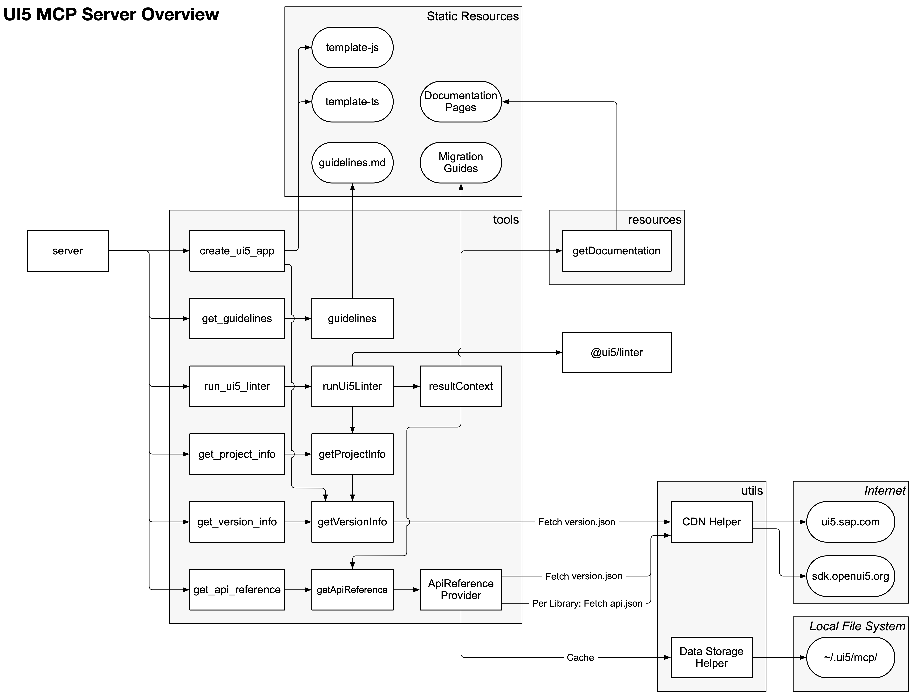

# UI5 MCP Server Architecture Document

# 1. Summary

The UI5 Model Context Protocol (MCP) server is a Node.js application written in TypeScript that provides a set of tools to assist AI agents in UI5 application development. The primary goal of this project is to streamline the development process by automating repetitive tasks, providing quick access to UI5 resources, and ensuring adherence to best practices.

It should fill the knowledge gap between today's large language models and the latest UI5 development practices, while providing dynamic information specific to the UI5 project the developer is currently working on.

# 2. Project Status

The project is still in development. While features can be proposed (for example through GitHub issues), the focus is currently on evaluating the present set of features (especially tools) and iteratively improving them through user feedback.

# 3. Introduction

The UI5 MCP server is built on top of the official [TypeScript SDK for Model Context Protocol servers](https://github.com/modelcontextprotocol/typescript-sdk) and exposes a collection of tools, each designed to address a specific aspect of UI5 development. These tools include project creation, code linting, API reference lookup, and framework version retrieval.

This document outlines the architecture of the UI5 MCP server, detailing the package's components, key technical decisions, and the overall design. It serves as a guide for both developers contributing to the project and users who want to understand its inner workings.

# 4. Architecture Input

## Goals

The primary motivation behind this project is to accelerate UI5 development by automating common tasks and providing developers with instant access to relevant information. The server's tools are designed to be seamlessly integrated into AI-driven development workflows, enabling developers to focus on building high-quality applications while the AI assistant handles repetitive and time-consuming tasks.

## Requirements

The UI5 MCP server must meet the following requirements:

- **Modularity**: Each tool should be implemented as a separate module to facilitate independent development and testing.
- **Reuse**: The server should leverage existing libraries and frameworks where possible to reduce TCO and ensure reliability.
- **Security**: The server must implement robust security measures to protect sensitive data and safeguard system integrity.
- **Compatibility**: The server should be compatible with MCP hosts commonly used for UI5 development.
- **Actuality**: The server should stay up-to-date with the latest UI5 development practices and tools, ensuring that it provides relevant and accurate information to developers.
- **Relevance**: The information provided by the server should be relevant to the application the developer is working on.

## Given / Existing Technology, Components and Services

The server is implementing the evolving [MCP specification](https://modelcontextprotocol.io/specification/2025-06-18), which defines a standard protocol for AI agents to interact with development tools. It is built using Node.js and TypeScript, leveraging the official TypeScript SDK for Model Context Protocol servers. The server also integrates with various UI5 tools, such as the [UI5 CLI](https://ui5.github.io/cli/stable/) and [UI5 linter](https://github.com/UI5/linter).

This allows for wide usage of the server in different environments, including local development setups and cloud-based AI platforms.

### Terminology

**Quoting from ["Concepts of MCP"](https://modelcontextprotocol.io/docs/learn/architecture#concepts-of-mcp):**

> MCP follows a client-server architecture where an MCP host — an AI application like Claude Code or Claude Desktop — establishes connections to one or more MCP servers. The MCP host accomplishes this by creating one MCP client for each MCP server. Each MCP client maintains a dedicated one-to-one connection with its corresponding MCP server.
>
> The key participants in the MCP architecture are:
>
> * **MCP Host:** The AI application that coordinates and manages one or multiple MCP clients
> * **MCP Client:** A component that maintains a connection to an MCP server and obtains context from an MCP server for the MCP host to use
> * **MCP Server:** A program that provides context to MCP clients

## Scope and Assumptions

The UI5 MCP server should ideally only act as a proxy for existing tools and resources related to UI5 development. It should not implement new tools or extensive functionality. Instead, it should focus on providing a unified interface for accessing these tools and resources, making it easier for AI agents to interact with them.

If requirements for new, complex tools arise, they be should implemented as independent tools, outside of this project.

# 5. Architecture Overview



[**🔍 Enlarge Architecture Overview Diagram**](./diagrams/architecture-overview.png)

## Tools

The UI5 MCP server provides the following tools:

Tool Name | Description
--------- | --------
`create_integration_card` | Scaffolds a new UI Integration Card
`create_ui5_app` | Scaffolds a new UI5 application based on a set of templates
`get_api_reference` | Fetches and formats UI5 API documentation
`get_guidelines` | Provides access to UI5 development best practices
`get_integration_cards_guidelines` | Gives UI Integration Cards development best practices
`get_project_info` | Extracts metadata and configuration from a UI5 project
`get_typescript_conversion_guidelines` | Provides guidelines for converting UI5 applications and controls from JavaScript to TypeScript
`get_version_info` | Retrieves version information for the UI5 framework
`run_ui5_linter` | Integrates with `@ui5/linter` to analyze and report issues in UI5 code
`run_manifest_validation` | Validates the manifest against the UI5 Manifest schema

### create_integration_card

The `create_integration_card` tool is designed to scaffold new UI Integration Cards using predefined templates. It automates the setup process, ensuring that developers can quickly start building integration cards without manually configuring the project structure.

Templates are stored in the `resources/` directory of the project. There is currently one template for every declarative card type (List Card, Table Card, etc.).

For rendering the templates with the provided data, the [EJS](https://github.com/mde/ejs) templating engine is used. 

### create_ui5_app

The `create_ui5_app` tool is designed to scaffold new UI5 applications using predefined templates. It automates the setup process, ensuring that developers can quickly start building applications without manually configuring the project structure.

Templates are stored in the `resources/` directory of the project. There are currently two templates, one for JavaScript based UI5 projects and one for TypeScript based UI5 projects.

For rendering the templates with the provided data, the [EJS](https://github.com/mde/ejs) templating engine is used. This engine is also used by [Yeoman](https://github.com/yeoman/generator), which is a popular choice in the UI5 community. This allows a reuse of the same templates currently consumed via Yeoman, located in the [ui5-community/generator-ui5-ts-app](https://github.com/ui5-community/generator-ui5-ts-app) project.

Note that the templates taken from that project have been extended in the UI5 MCP server. An OData model setup has been added, as well as UI changes to display the data. In the future, those changes should be fed back to one of the "easy-UI5" project repositories, where the templates are then maintained.

### get_api_reference

The `get_api_reference` tool fetches and formats API reference documentation for the UI5 framework. It provides agents with streamlined access to relevant API information, helping them to understand and utilize UI5 components effectively.

For a given UI5 version it fetches all available `api.json` resources (one per library) from either the SAPUI5- or OpenUI5 CDN. For the sap.ui.core library, the SAPUI5-CDN-URL would be for example [`https://ui5.sap.com/1.136.7/test-resources/sap/ui/core/designtime/api.json`](https://ui5.sap.com/1.136.7/test-resources/sap/ui/core/designtime/api.json). The UI5 framework and version is [derived](https://ui5.github.io/cli/stable/pages/Configuration/#framework-configuration) from the `ui5-local.yaml` or `ui5.yaml` file of a given project. Therefore a project path must be provided in the tool call. If the project does not configure framework information, OpenUI5 version `1.136.5` will be used.

The list of libraries is determined using the `sap-ui-version.json` resource (e.g. [`https://ui5.sap.com/1.136.7/resources/sap-ui-version.json`](https://ui5.sap.com/1.136.7/resources/sap-ui-version.json)), excluding libraries that start with the name `themelib_` (indicating theme libraries, which do not contain API references). Not all libraries provide `api.json` files, so 404 errors are expected for some libraries. The tool will handle these gracefully, except for the sap.ui.core library. The core library's `api.json` file is expected to always be present, so a 404 error for this resource indicates an incorrect version or a problem with the CDN.

The files are downloaded and stored in a local cache directory, which is located in the `~/.ui5/mcp-server/api_json_files/` directory on the user's machine (this can be [configured](#cache-management)).

After downloading the files, they are parsed and indexed. The index is stored in an `index.json` file located in the same directory. The index keys are lowercase strings of the `name` properties of all entries (symbols). Any `module:` prefix is removed and slashes are converted to dots. This allows for a consistent and case-insensitive way of querying the index for symbols without holding all `api.json` files in memory.

**Extract of the `index.json:**

```json
"sap.ui.util.xmlhelper": {
    "name": "module:sap/ui/util/XMLHelper",
    "filePath": "sap.ui.core.api.json"
},
"sap.ui.versioninfo": {
    "name": "module:sap/ui/VersionInfo",
    "filePath": "sap.ui.core.api.json"
},
"sap": {
    "name": "sap",
    "filePath": "sap.ui.core.api.json"
},
"sap.ui": {
    "name": "sap.ui",
    "filePath": "sap.ui.core.api.json"
},
"sap.ui.app": {
    "name": "sap.ui.app",
    "filePath": "sap.ui.core.api.json"
},
"sap.ui.app.application": {
    "name": "sap.ui.app.Application",
    "filePath": "sap.ui.core.api.json"
},
"sap.ui.app.mockserver": {
    "name": "sap.ui.app.MockServer",
    "filePath": "sap.ui.core.api.json"
},
"sap.ui.base": {
    "name": "sap.ui.base",
    "filePath": "sap.ui.core.api.json"
},
"sap.base.assert": {
    "name": "module:sap/base/assert",
    "filePath": "sap.ui.core.api.json"
},
```

When a query is made to the tool, the index is searched for the given symbol. If found, the corresponding `api.json` file is loaded from disk (if not already in memory) and the full symbol information is extracted.

This information is then "formatted" and returned to the caller. The formatting is done by removing all properties that are not relevant for understanding the API. For example, the `resource` property, which contains the filename of the source file, is removed. Also, properties that are empty or `null` are removed. The goal is to reduce the size of the response and focus on the most relevant information for the given context.

Depending on the context, the tool can further reduce the returned API reference. For example for a query like `sap.m.Button#text` it would only return the API reference for the `text` property of the `sap.m.Button` class, rather than the entire class definition with all its properties and aggregations.

Other tools, such as `run_ui5_linter` might also request a "Summarized API Reference". For a given symbol (e.g. `sap.m.Button`), this would only return general metadata such as the module name, namespace, description and deprecation info (if applicable), but not the full list of properties, aggregations, etc.  
Again, this is to reduce the size of the response and focus on the most relevant information for the given context.

#### Example Output

```js
{
	"uri": "https://openui5.org/1.136.5/api/sap.m.Button/controlProperties/text",
	"mimeType": "application/json",
	"text": "{\n  \"kind\": \"ui5-property\",\n  \"name\": \"text\",\n  \"type\": \"string\",\n  \"group\": \"Misc\",\n  \"description\": \"Determines the text of the <code>Button</code>.\",\n  \"methods\": [\n    \"getText\",\n    \"setText\"\n  ],\n  \"module\": \"sap/m/Button\",\n  \"library\": \"sap.m\"\n}"
}

/* Formatted JSON content of the text property: */
{
	"kind": "ui5-property",
	"name": "text",
	"type": "string",
	"group": "Misc",
	"description": "Determines the text of the <code>Button</code>.",
	"methods": ["getText","setText"],
	"module": "sap/m/Button",
	"library": "sap.m"
}
```

#### Outlook

It should be investigated whether the semantic model can be replaced by a more lightweight solution that could be integrated into the UI5 linter project. UI5 linter currently already requires selected API reference information that is not supplied in the UI5 TypeScript definitions. Therefore it might be reasonable to provide a generic "UI5 API reference"-API there.

Drawbacks of the current approach using the semantic model:

* Memory consumption: The semantic model loads all API references into memory, this can become quite large
	* This could be optimized by only loading those API references relevant to the current project (derived from the dependencies declared in the projects ui5.yaml an/or manifest.json). UI5 linter implements a similar optimization for loading the TypeScript definitions
* Missing properties: The semantic model currently does not provide access to some recently added properties of the api.json files. For example the `methods` array on control metadata entries

### get_guidelines

The `get_guidelines` tool returns a single markdown resource containing best practices and guidelines for UI5 development, particularly targeted towards AI agents. The document can be found in the `resources/` directory of the project.

### get_integration_cards_guidelines

The `get_integration_cards_guidelines` tool returns a single markdown resource containing best practices and guidelines for UI Integration Cards development. The content is particularly targeted towards AI agents. The document can be found in the `resources/` directory of the project.

### get_project_info

The `get_project_info` tool extracts metadata and configuration from a UI5 project. It provides insights into the project's structure, dependencies, and configuration settings, helping developers understand the context of their application.

This tool makes use of [@ui5/project](https://github.com/SAP/ui5-project) to gather general project information. This includes the name of the project and (if configured), the name and version of the UI5 framework used in the project, as well as the used framework libraries.

It also uses functionality provided by the `get_version_info` tool to compile relevant information regarding the used UI5 version. This includes the support status of the version as well as the latest patch- and absolute version.

#### Example Output

```json
{
	"projectDir": "/absolute/path/to/openui5-sample-app",
	"projectName": "openui5-sample-app",
	"projectType": "application",
	"frameworkName": "OpenUI5",
	"frameworkVersion": "1.136.1",
	"frameworkLibraries": [
		"sap.f",
		"sap.m",
		"sap.ui.core",
		"sap.ui.commons",
		"themelib_sap_horizon"
	],
	"versionInfo": {
		"supportStatus": "Outdated patch version. Upgrade to '1.136.5'.",
		"isLts": true,
		"latestVersion": "1.139.0",
		"latestLtsVersion": "1.136.5"
	}
}
```

### get_typescript_conversion_guidelines

The `get_typescript_conversion_guidelines` tool returns a single markdown resource containing best practices and guidelines for the conversion of apps, controls and tests from JavaScript to TypeScript. The content is particularly targeted towards AI agents and the type of support they currently need, as they are not aware of all UI5 specifics in this process. The document can be found in the `resources/` directory of the project.

The markdown document mentions dependencies which need to be added. At tool invocation time, the current version of these packages is retrieved from npm and added to the document using placeholders.

### get_version_info

The `get_version_info` tool provides an overview of the currently supported versions of the UI5 framework.

This information is fetched from the UI5 CDN, either from [`https://ui5.sap.com/version.json`](https://ui5.sap.com/version.json) (for framework `SAPUI5`) or [`https://sdk.openui5.org/version.json`](https://sdk.openui5.org/version.json) (for framework `OpenUI5`).

#### Example Output

```json
{
	"latest": {
		"version": "1.139.0",
		"support": "Maintenance",
		"lts": false
	},
	"active": {
		"version": "1.139.0",
		"support": "Maintenance",
		"lts": false
	},
	"1.139": {
		"version": "1.139.0",
		"support": "Maintenance",
		"lts": false
	},
	"1.136": {
		"version": "1.136.7",
		"support": "Maintenance",
		"lts": true
	},
	"[...]"
}
```

### run_ui5_linter

The `run_ui5_linter` tool integrates with the `@ui5/linter` package to analyze UI5 code and report issues. It helps maintain code quality by identifying potential problems and suggesting improvements based on best practices.

#### Context Information

In addition to the linter findings, context information will be added to the response if the `provideContextInformation` parameter is set to `true`. This information includes:

* **Rule Descriptions:** Short descriptions of the linter rules that were violated
	* These are currently hard coded in the UI5 MCP server, but should be moved to the UI5 linter
	* They can also reference UI5 documentation pages, which will then be included in the result context as well
* **API References**: "Summary" versions of UI5 API reference entries for any UI5 API referenced in the linter findings
* **Documentation Resources:** Selected markdown resources of UI5 documentation pages relevant to the linter findings
* **Migration Guides:** Markdown resources describing migration steps for selected linter findings (see below)

#### Fixing Problems

The tool provides a `fix` parameter which will instruct `@ui5/linter` to automatically fix problems where possible.

For some of the problems that can not be fixed automatically, the tool will provide a list of **migration guides** that can be used to fix the problems manually or with AI-assistance. These guides are stored in the `resources/migrationGuides/` directory of the project and are written in markdown format. These guides are always provided if context information is requested, independently of the `fix` parameter.

In the future, these guides should be moved into the UI5 linter project. See also [Technical Debts](#dechnical-debts).

#### Example Output

```json
{
	"results": [
		{
			"filePath": "ui5.yaml",
			"messages": [
				{
					"ruleId": "no-deprecated-library",
					"severity": 2,
					"line": 12,
					"column": 7,
					"message": "Use of deprecated library 'sap.ui.commons'"
				}
			]
		},
		{
			"filePath": "webapp/Component.js",
			"messages": [
				{
					"ruleId": "no-deprecated-api",
					"severity": 2,
					"line": 1,
					"column": 75,
					"message": "Import of deprecated module 'sap/m/DateTimeInput'",
					"messageDetails": "As of version 1.32.8. replaced by sap.m.DatePicker (https://ui5.sap.com/1.136/#/api/sap.m.DatePicker), sap.m.TimePicker (https://ui5.sap.com/1.136/#/api/sap.m.TimePicker) or sap.m.DateTimePicker (https://ui5.sap.com/1.136/#/api/sap.m.DateTimePicker)"
				},
				{
					"ruleId": "async-component-flags",
					"severity": 1,
					"line": 4,
					"column": 9,
					"message": "Component does not specify that it uses the descriptor via the manifest.json file",
					"messageDetails": "A manifest.json has been found in the same directory as the component. Although it will be used at runtime automatically, this should still be expressed in the metadata of the component class (https://ui5.sap.com/#/topic/0187ea5e2eff4166b0453b9dcc8fc64f)."
				}
			]
		},
		"..."
	],
	"projectDir": "/openui5-sample-app",
	"frameworkVersion": "1.136.1",
	"contextInformation": {
		"ruleDescriptions": [
			{
				"ruleId": "no-deprecated-library",
				"description": "The projects `manifest.json` and/or `ui5.yaml` declare dependencies to deprecated UI5 framework libraries"
			},
			{
				"ruleId": "no-deprecated-api",
				"description": "Deprecated UI5 API must not be used. Check the individual API reference for details on how to replace it."
			},
			{
				"ruleId": "async-component-flags",
				"description": "Components must be configured for asynchronous loading via the `sap.ui.core.IAsyncContentCreation` interface in the Component metadata or via `async` flags in the `manifest.json`"
			},
			{
				"ruleId": "no-pseudo-modules",
				"description": "Deprecated pseudo modules are used"
			},
			{
				"ruleId": "no-globals",
				"description": "Global variables must not be used for accessing UI5 framework APIs and should be avoided in application code. The respective modules should be imported explicitly."
			},
			{
				"ruleId": "parsing-error",
				"description": "During the linting process a syntax or parsing error occured"
			}
		],
		"apiReferences": [
			{
			"kind": "class",
			"name": "sap.m.DateTimeInput",
			"module": "sap/m/DateTimeInput",
			"extends": "sap.ui.core.Control",
			"description": "Allows end users to interact with date (between 0001-01-01 and 9999-12-31) and/or time and select from a date and/or time pad.\n\n<b>Note:</b> This control should not be used any longer, instead please use the dedicated <code>sap.m.DatePicker</code>, <code>sap.m.TimePicker</code> or <code>sap.m.DateTimePicker</code> control.",
			"library": "sap.m",
			"_summaryInfo": "Note: This object is a shortened version of the full API object"
			},
			{
				"kind": "event",
				"name": "tap",
				"parameters": [
					{
						"name": "oControlEvent",
						"type": "sap.ui.base.Event",
						"parameterProperties": {
							"getSource": {
								"name": "getSource",
								"type": "sap.ui.base.EventProvider",
								"optional": false
							},
							"getParameters": {
								"name": "getParameters",
								"type": "object",
								"optional": false
							}
						}
					}
				],
				"description": "Fired when the user taps the control.",
				"deprecated": {
					"since": "1.20",
					"text": "replaced by <code>press</code> event"
				},
				"module": "sap.m.Button",
				"library": "sap.m"
			},
			{
				"kind": "method",
				"name": "byId",
				"returnValue": {
					"type": "sap.ui.core.Element|undefined",
					"description": "Element with the given ID or <code>undefined</code>"
				},
				"parameters": [
					{
						"name": "sId",
						"type": "sap.ui.core.ID|null|undefined",
						"optional": false,
						"description": "ID of the element to search for"
					}
				],
				"description": "<large description removed in architecture document>",
				"deprecated": {
					"since": "1.119",
					"text": "Please use {@link sap.ui.core.Element.getElementById Element.getElementById} instead."
				},
				"module": "sap.ui.core.Core",
				"library": "sap.ui.core"
			},
			{
				"kind": "class",
				"name": "sap.f.Avatar",
				"module": "sap/f/Avatar",
				"extends": "sap.m.Avatar",
				"description": "<large description removed in architecture document>",
				"library": "sap.f",
				"_summaryInfo": "Note: This object is a shortened version of the full API object"
			},
			{
				"kind": "class",
				"name": "sap.m.DatePicker",
				"module": "sap/m/DatePicker",
				"extends": "sap.m.DateTimeField",
				"description": "<large description removed in architecture document>",
				"library": "sap.m",
				"_summaryInfo": "Note: This object is a shortened version of the full API object"
			},
			{
				"kind": "class",
				"name": "sap.m.TimePicker",
				"module": "sap/m/TimePicker",
				"extends": "sap.m.DateTimeField",
				"description": "<large description removed in architecture document>",
				"library": "sap.m",
				"_summaryInfo": "Note: This object is a shortened version of the full API object"
			},
			{
				"kind": "class",
				"name": "sap.m.DateTimePicker",
				"module": "sap/m/DateTimePicker",
				"extends": "sap.m.DatePicker",
				"description": "<large description removed in architecture document>",
				"library": "sap.m",
				"_summaryInfo": "Note: This object is a shortened version of the full API object"
			},
			"..."
		],
		"documentationResources": [
			{
				"title": "Best Practices for Loading Modules",
				"text": "# Best Practices for Loading Modules\n\nThis section provides best practices for SAPUI5 module loading patterns.[...]",
				"uri": "https://ui5.sap.com/1.136.7/topic/00737d6c1b864dc3ab72ef56611491c4"
			},
			{
				"title": "Best Practices for Developers",
				"text": "# Best Practices for Developers\n\nThis page is a good starting point for you to ensure your code bases,[...]",
				"uri": "https://ui5.sap.com/1.136.7/topic/28fcd55b04654977b63dacbee0552712"
			},
			{
				"title": "Deprecated Themes and Libraries",
				"text": "# Deprecated Themes and Libraries\n\nAs SAPUI5 evolves over time, [...]",
				"uri": "https://ui5.sap.com/1.136.7/topic/a87ca843bcee469f82a9072927a7dcdb"
			},
			{
				"title": "Use Asynchronous Loading",
				"text": "# Use Asynchronous Loading\n\nAsynchronous loading is the way to go: [...]",
				"uri": "https://ui5.sap.com/1.136.7/topic/676b636446c94eada183b1218a824717"
			},
			"..."
		],
		"migrationGuides": [
		{
			"title": "deprecated-controller-factory.md",
			"text": "# Guide for Migrating the Deprecated `sap.ui.controller` Function\n\n[...]",
			"uri": "ui5-linter-result://migration-guides/deprecated-controller-factory.md"
		}]
	}
}
```

### run_manifest_validation

The `run_manifest_validation` tool provides comprehensive schema validation for UI5 manifest files (`manifest.json`). It ensures that manifest files conform to the official UI5 Manifest JSON Schema, helping developers catch configuration errors early in the development process.

#### Overview

This tool uses the [Ajv JSON schema validator](https://www.npmjs.com/package/ajv) (specifically Ajv 2020-12) to perform validation against the official manifest schema. The schema is dynamically fetched from the [UI5 Manifest repository](https://github.com/SAP/ui5-manifest) based on the `_version` property declared in the manifest file.

#### Schema Management

**Version Detection:**
- The tool automatically detects the manifest version from the `_version` property
- If the `_version` property is missing, malformed, or not a valid semantic version, validation fails with a helpful error message listing supported versions
- The minimum supported manifest version is **1.68.0** (earlier versions use incompatible meta-schemas)

**Schema Retrieval:**
- Schemas are fetched from: `https://raw.githubusercontent.com/SAP/ui5-manifest/v{version}/schema.json`
- A version mapping is maintained at: `https://raw.githubusercontent.com/SAP/ui5-manifest/main/mapping.json`
- Schemas are cached locally after first fetch to improve performance and reduce network requests
- External schemas referenced by the UI5 manifest schema (e.g., Adaptive Card schema) are also fetched and cached as needed.

#### Validation Process

- Reads the manifest file from the provided absolute path
- Parses the JSON content and extracts the `_version` property
- Fetches the corresponding schema based on the version
- Uses Ajv to validate the manifest against the schema
- Returns a detailed report of validation results, including specific error messages for any violations found

#### Performance Characteristics

**Caching Strategy:**
- Schema files are cached in memory after first retrieval
- Cache is shared across multiple validation calls in the same process
- Mutex locks prevent duplicate concurrent downloads of the same schema
- Network requests are only made once per schema version per process lifecycle

#### Error Handling

**Input Errors:**
- Non-absolute paths: `InvalidInputError` with clear message
- File not found: `InvalidInputError` indicating the file doesn't exist
- Invalid JSON: `InvalidInputError` with JSON parsing error details
- Missing `_version`: Detailed error with list of supported versions
- Unsupported version: Error message with version requirements and supported versions list

**Network Errors:**
- Schema fetch failures are caught and reported with helpful context
- The tool provides fallback error messages even if the supported versions list cannot be fetched
- Cached schemas allow continued operation even if the network is unavailable after initial setup

#### Example Input

```json
{
	"manifestPath": "/absolute/path/to/project/webapp/manifest.json"
}
```

#### Example Output for Invalid Manifest

```json
{
	"isValid": false,
	"errors": [
		{
			"keyword": "required",
			"instancePath": "",
			"schemaPath": "#/required",
			"params": {
				"missingProperty": "sap.ui"
			},
			"message": "must have required property 'sap.ui'"
		},
		{
			"keyword": "required",
			"instancePath": "/sap.app",
			"schemaPath": "#/properties/sap.app/required",
			"params": {
				"missingProperty": "title"
			},
			"message": "must have required property 'title'"
		}
	]
}
```

#### Example Output for Valid Manifest

```json
{
	"isValid": true,
	"errors": []
}
```

#### Requirements

- **Network Access**: Initial schema fetch requires internet connectivity
- **Manifest Versioning**: The manifest must declare a valid `_version` property

## Resources

### UI5 Documentation

While the UI5 MCP server currently does not offer a dedicated tool for searching the official UI5 documentation, it provides access to selected documentation pages through the `run_ui5_linter` tool. This tool can return relevant documentation resources as part of its context information, which can be used to guide developers in fixing linter issues or understanding best practices.

The number of included pages should be kept low, focusing on the most fundamental concepts of UI5 development. The pages should be modified from the original, by removing superfluous white spaces, cleaning up or removing links as well as references to images.

In the future, these selected documentation pages may be exposed as [resources](https://modelcontextprotocol.io/specification/2025-06-18/server/resources) so that they can be accessed by AI agents directly, rather than only through the context information of the linter results.

We assume that dedicated solutions for searching UI5 documentation in the context of AI agents will be offered in the future. The UI5 MCP server therefore does not offer such a tool at this point.

## Outlook

The following is a collection of ideas that could be added to the UI5 MCP server in the future.

* Providing access to [UI5 sample code](https://ui5.sap.com/#/controls)
* [Prompt](https://modelcontextprotocol.io/specification/2025-06-18/server/prompts) for fixing all UI5 linter problems in a UI5 project
	* The initial prompt may already contain all linter findings, version information and other context relevant for fixing the problems

# 6. Architecture Decisions

## Major Decisions, Challenges and Risks

### Technology Decisions

* **Node.js and TypeScript**: The server is built using Node.js and TypeScript.
	* This choice is the current standard for new UI5-tooling projects. There is great know-how with both, the implementing team in the UI5 development organization as well as in the UI5 community
	* The TypeScript SDK for Model Context Protocol servers provides a solid foundation for implementing MCP servers in TypeScript. Only the Python SDK might provide an even richer feature set.
* **Model Context Protocol (MCP)**: The server implements the MCP specification.
	* This is the standard protocol for AI agents to interact with development tools. It allows for a consistent and extensible interface for AI-driven development workflows.

### Risks

* Other models and standards for integrating tools into agentic-AI workflows might emerge in the future and make MCP obsolete.
	* **Mitigation:** By relying on reusing existing tools and libraries, rather than implementing complex, MCP-specific functionality in the UI5 MCP server project, the server can be easily adapted for new protocols and standards as they emerge.
* Some of the provided tools might turn out to not be helpful for AI agents.
	* **Mitigation:** Collect feedback from end-users and establish a process for benchmarking the performance of selected tools.

## Communication

### Transport

The UI5 MCP server supports the [**stdio** transport mechanism](https://modelcontextprotocol.io/specification/2025-06-18/basic/transports#stdio). Streamable HTTP or other transports shall not be supported.

### Tool Results

*[Specification reference](https://modelcontextprotocol.io/specification/2025-06-18/server/tools#tool-result)*

#### Unstructured Content

This is currently the most widely supported response form. Unstructured content does not follow a defined schema. The UI5 MCP server shall return unstructured content in the form of plain text or ["embedded resources"](https://modelcontextprotocol.io/specification/2025-06-18/server/tools#embedded-resources) (or a combination of both).

As per the specification, tools must provide unstructured content for compatibility reasons.

#### Structured Content

Structured content is returned as a JSON object. The structure of the response is defined by the tool itself using a JSON schema. Support for structured content among MCP Hosts is limited and there is [discussion](https://github.com/modelcontextprotocol/modelcontextprotocol/discussions/1121) around actual benefits of providing this.

As per the specification, returning structured content is optional for tools.

### Logging

Logging shall be done using the [`@ui5/logger`](https://github.com/SAP/ui5-logger) module. This module is also used within `@ui5/project` and `@ui5/linter` and allows for consistent logging across the server.

The [MCP specification](https://modelcontextprotocol.io/specification/2025-06-18/basic/transports#stdio) dictates that `stdout` must not be used for anything other than valid MCP messages. The recommended logging mechanism is to use `stderr` for logging messages.

By default, `@ui5/logger` is using `stderr`. It is therefore adhering to the MCP specification.

The log level can be configured using the `UI5_LOG_LVL` environment variable. For details, refer to the [UI5 CLI documentation](https://ui5.github.io/cli/stable/pages/Troubleshooting/#changing-the-log-level).

For traceability, **every tool invocation should be logged**. The log should contain the tool name and relevant parameters passed to the tool.

### Error Handling

Errors shall be distinguished between "internal" errors and errors that are related to the input/parameters of the tool.

**Examples for "internal" errors:**

* Failed to download API reference resources from CDN due to lack of internet connection
* Failed to write files to cache due to permission errors
* Failed to start due to invalid Node.js version

**Examples for "input" errors:**

* Failed to find API reference for a given symbol because it does not exist
* Failed to lint a project because the provided path does not point to a valid UI5 project

Dedicated classes for input errors shall be used to easily distinguish them.

Note that the MCP SDK automatically catches all errors and converts them to [Tool Execution Errors](https://modelcontextprotocol.io/specification/2025-06-18/server/tools#error-handling).

For internal errors, this might not be expected. The AI agent likely won't be able to resolve most of them. Ideally, the developer would be informed about such errors directly. Unfortunately the current MCP specification does not provide a way to produce such "user-facing" errors.

It is to be discussed whether the content of internal errors should be communicated to the AI agent at all, or only a generic message shall be sent. This would be a security precaution, similar to how public web applications handle errors, where the content of internal error messages can expose sensitive information about the system.

## Cache Management

The UI5 MCP server uses a local cache to store downloaded resources, such as API reference files. This cache is located in the `~/.ui5/` directory on the user's machine. This directory can be configured by setting the environment variable `UI5_DATA_DIR`. This concept is aligned with the [UI5 CLI's "Data Directory"](https://ui5.github.io/cli/stable/pages/Troubleshooting/#changing-ui5-clis-data-directory).

## Security

### Input

For MCP Servers, the MCP specification states the following regarding [security considerations](https://modelcontextprotocol.io/specification/2025-06-18/server/tools#security-considerations):

> **Servers MUST:**
>
> * Validate all tool inputs
> * Implement proper access controls
> * Rate limit tool invocations
> * Sanitize tool outputs

The more detailed [Security Best Practices](https://modelcontextprotocol.io/specification/2025-06-18/basic/security_best_practices) currently do not seem to list any risks that are directly applicable to the UI5 MCP server. In its current form, it does not handle any authentication or session tokens.

### Threat Model

As part of the development process, a preliminary threat model has been created to identify potential security risks and mitigation strategies. Some of the documentation related to this process has not been added to this document yet. See the internal JIRA CPOUI5FOUNDATION-1107 for more information.

#### Summary

The UI5 MCP server acts as a privileged process on a developer's local machine. It has the authority to read from and write to the filesystem, execute system commands (like `git` and `npm`), and make network requests.

The primary threat actor is an attacker who can influence the inputs sent from the MCP host to the UI5 MCP server. This could be achieved through malicious prompts, compromised AI models, or by exploiting vulnerabilities in the MCP host itself.

Due to the local execution environment, the UI5 MCP server does not handle any authorization tokens or user credentials. It does not interact with external services that require user authentication or authorization. It also does not have access to the data of multiple users or sessions simultaneously. This greatly reduces the attack surface and simplifies the security model.

### Overview & Trust Boundaries

* **Core Asset:** The developer's local machine, including source code, configuration files, credentials, and system integrity.
* **Privileged Component:** The UI5 MCP server (a Node.js process). It runs with the permissions it has been granted by the MCP host, usually the same as the user who launched it.
* **Untrusted Input Source:** The MCP host. While the host itself may be trusted, the *data* it sends (tool inputs derived from LLM output) is inherently untrusted and must be validated.
* **Trust Boundary:** The interface between the MCP host and the UI5 MCP server. All data crossing this boundary is a potential attack vector.

### What the UI5 MCP server Trusts

The server operates on the assumption that the following components are secure and behave as expected:

* Its developers and maintainers
* **Its own codebase:** The compiled TypeScript/JavaScript code of the UI5 MCP server itself is considered trusted.
* **The local execution environment:** It trusts the Node.js runtime, the MCP host itself (e.g. VS Code) and the underlying operating system on which it is running. It assumes these have not been compromised.
	* It trusts that the MCP host sufficiently protects against denial of service attacks, such as resource exhaustion, by limiting the number of requests it sends to the UI5 MCP server.
* **The resources it accesses:** Such as files or network resources, unless they are read from an untrusted source (e.g. user-provided URLs).
	* It trusts the user's UI5 project, including the source code and configuration files, to be valid and not malicious.
* **Its vetted dependencies:** Core, well-known dependencies required for its operation are implicitly trusted. This includes:
	* The `@ui5/linter` package is trusted not to have vulnerabilities that allow for code injection through its parameters. In particular its autofix mechanism, while modifying source code is trusted not to inject malicious code.
	* The `@ui5/project` package is trusted to correctly parse and validate UI5 project configurations.
	* The `@modelcontextprotocol/typescript-sdk` is trusted to correctly implement the MCP protocol over `stdio`.
* **The Integrity of the `stdio` Channel:** Since communication is restricted to `stdio`, the server trusts that the communication channel itself is private between it and the parent process that launched it (the MCP Host). It does not defend against a separate malicious process on the same machine that has the privileges to inspect or interfere with this channel.

### What the UI5 MCP server DOES NOT Trust

* **All input from the MCP host:** The server does not trust any data received in the `params` object of a `tools/call` request. The AI assistant that generates this data is considered an unpredictable and untrusted source.

If the data passed through the tool-parameters can trigger actions other than those documented, that might be a security vulnerability. Examples for unwanted actions are the deletion of files, arbitrary code execution, or any other unexpected side effects that can lead to a loss of confidentiality, integrity, or availability.

### Security Measures

* **Input Validation:** All tool inputs must be validated against a JSON schema (using [Zod](https://zod.dev/)). This ensures that only expected and safe parameters are processed.
	* Parameters that are passed to templating engines should be strictly validated to prevent command- and template injection attacks.
* **Path Restriction:** All input paths must be normalized and validated
	* For most tools, the provided path is supposed to be a valid UI5 project directory. This must be validated, for example by checking whether `@ui5/project` can create a UI5 project for the given path.
	* If the MCP client supports the ["roots"](https://modelcontextprotocol.io/specification/2025-06-18/client/roots#roots)capability, UI5 MCP server must restrict the paths that can be accessed by the tool to the provided roots.
		* As an exception to this rule, the UI5 MCP server will still write to its own cache directory, typically located in the `~/.ui5/mcp-server/` directory. This is necessary to store downloaded resources and other temporary data. See [Cache Management](#cache-management) for more details.

## Building and Testing

* [TypeScript compiler](https://github.com/microsoft/TypeScript) (`tsc`) is used to compile the TypeScript code into JavaScript.
* [tsx](https://github.com/privatenumber/tsx) is used to run the TypeScript code directly in Node.js during development, without a separate compilation step.
* [ava](https://github.com/avajs/ava/) is used for testing

## Distribution

The UI5 MCP server is published to the [official npm registry](https://www.npmjs.com/), making it easily accessible for Node.js-based development environments and MCP hosts that support npm package installation.

The [MCP registry](https://registry.modelcontextprotocol.io/) holds a reference to the npm registry package. The MCP specification owners provide this registry, which serves as the primary source for other MCP registries to retrieve their information. This approach eliminates the need to publish to multiple registries individually. It ensures broad accessibility across the MCP ecosystem.

For more information about the MCP registry, see the [registry repository](https://github.com/modelcontextprotocol/registry).

## Technical Debts

* `get_api_reference`: Custom implementation for handling the API reference files
	* Similar code already exists in UI5 linter, but it is not exposed as a reusable module
	* UI5 linter could be extended to provide this functionality, so that the MCP server does not need to maintain it
* `create_ui5_app`: Copies of EJS templates from the `generator-ui5-ts-app` project
	* Templates should stay up-to-date and in-sync with the original project
* `run_ui5_linter`: Rule descriptions and migration guides are currently hard-coded in the MCP Server
	* They should be provided by UI5 linter or another source in the future, so that the MCP Server does not need to maintain them (see "Reuse" [requirement](#requirements))
